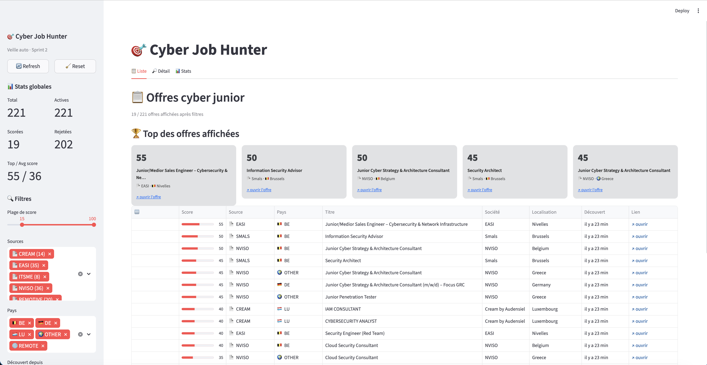
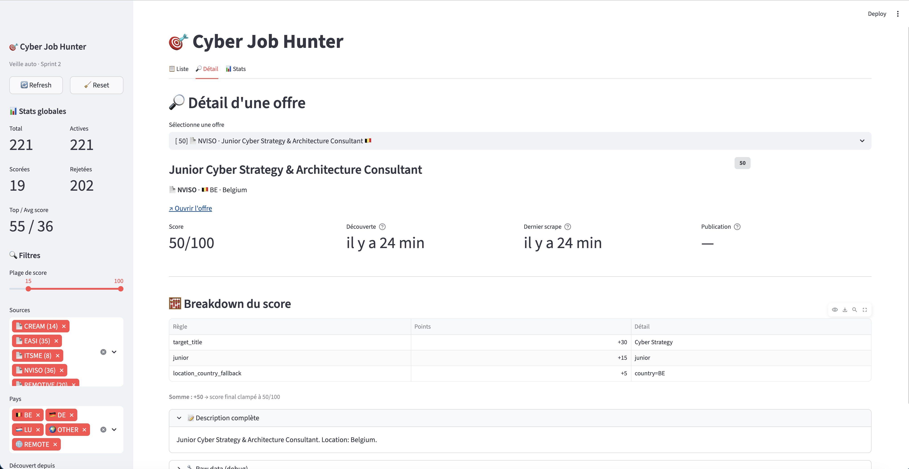
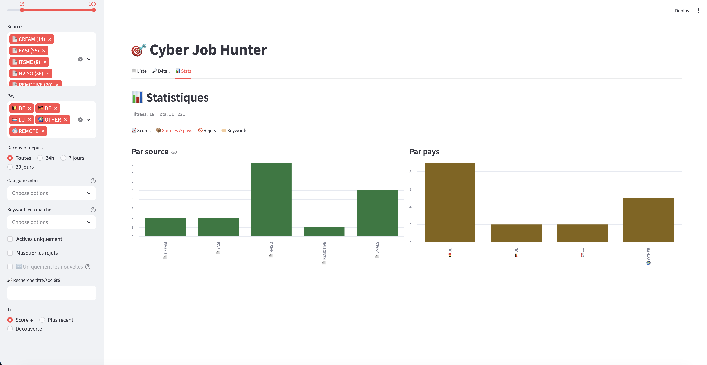

# 🎯 Cyber Job Hunter

> Scraper automatisé d'offres d'emploi cybersécurité junior, avec scoring personnalisé et dashboard live.

[](LICENSE)
[](pyproject.toml)
[](tests/)
[](tests/)
[](pyproject.toml)
[](pyproject.toml)
[](#-roadmap)

---

## 📌 Contexte

Projet personnel développé en parallèle de ma formation **Cybersécurité Blue & Red Team @ BeCode Bruxelles** (Feb–Aug 2026), en vue d'un stage en septembre 2026.

Il sert deux objectifs :

1. **Outil personnel** — automatiser ma veille sur les offres cyber junior alignées avec mon profil
2. **Projet portfolio** — démontrer mes compétences en Python, scraping responsable, automatisation, conception de pipelines de données et observabilité

## ✨ Fonctionnalités

- 🕷️ **13 scrapers** actifs sur les sources cyber BE/LU/Remote (cyber pure-players, ESN, services publics, Big Four, Workday/RSS/REST/HTML)
- 🎯 **Scoring personnalisable** avec 60+ titres cibles, 7 catégories de mots-clés tech, et un *cyber relevance gate* qui élimine les offres non-cyber
- 📊 **Dashboard Streamlit** local avec 3 vues (Liste / Détail / Stats), 10+ filtres, et accès distant via Tailscale
- 🆕 **Détection des nouvelles offres** (badge "Nouveau" depuis le run précédent, table `ScrapeRun` historique)
- 🛡️ **10 protections anti-ban** mutualisées dans `BaseScraper` : rate limit, jitter, backoff exponentiel, circuit breaker, détection captcha/Cloudflare, respect `robots.txt`
- 💾 **Storage SQLite** avec dédoublonnage par hash de contenu et soft delete
- 📁 **Export CSV** filtrable par score
- ✅ **307 tests** (91 % de coverage hors UI Streamlit), `mypy` strict, `ruff`

## 📸 Screenshots

### Tab Liste — Top 5 des offres + tableau filtrable

Vue principale avec sidebar (stats globales + 10 filtres : score, sources, pays, catégories cyber, keywords, "Découvert depuis", "Uniquement les nouvelles") et tableau triable. Le top 5 cartes met en avant les meilleures offres du moment.



### Tab Détail — Breakdown explicable du scoring

Pour chaque offre sélectionnée : score + métadonnées timeline (découverte, dernier scrape, publication), **breakdown ligne par ligne** des règles de scoring avec leurs points (target_title +30, junior +15, location_country_fallback +5, etc.), keywords matchés, raisons de rejet éventuelles, description complète et raw_data brut JSON repliable. Transparence totale sur le « pourquoi ce score ».



### Tab Stats — Distribution par source et par pays

Sous-onglets `Scores` (histogramme), `Sources & pays` (bar charts), `Rejets` (top raisons), `Keywords` (top 15 cyber matchés). Permet d'auditer le scoring et de visualiser la couverture du marché.



## 🏗️ Architecture

```
                ┌──────────────────────────────────────────────┐
                │      config/profile.yaml + sources.yaml      │
                │  (titres cibles, mots-clés, sources actives) │
                └──────────────────┬───────────────────────────┘
                                   │
                                   ▼
              ┌───────────────────────────────────────────┐
              │             BaseScraper (ABC)             │
              │  rate limit · jitter · backoff · circuit  │
              │  breaker · robots.txt · bot detection     │
              └─┬─────────────────────────────────────┬───┘
                │ ▲                                   │
                │ │ inherits                          │
                ▼ │                                   ▼
    ┌──────────────────────────┐         ┌──────────────────────┐
    │  REST/RSS/Workday scrapers│         │  HTML scrapers       │
    │  • Remotive (REST JSON)   │         │  • NVISO (utility)   │
    │  • Recruitee (itsme)      │         │  • EASI / Smals      │
    │  • Devoteam (GCP Talent)  │         │  • Cream / Travailler│
    │  • Capgemini (REST Azure) │         │  • Actiris (sitemap) │
    │  • KPMG (RSS TalentSoft)  │         │  • Orange Cyberdef.  │
    │  • Accenture (Workday CXS)│         │    (TeamTailor)      │
    └────────────┬──────────────┘         └─────────┬────────────┘
                 │                                  │
                 └──────────────┬───────────────────┘
                                │
                                ▼
                    ┌────────────────────────┐
                    │    JobBase (Pydantic)  │
                    └───────────┬────────────┘
                                │
                                ▼
                ┌──────────────────────────────────┐
                │  src/filters.py                  │
                │  rejet : senior, dutch required, │
                │  flandre EN-only, NOT_CYBER_GATE │
                └──────────────┬───────────────────┘
                               │
                               ▼
                    ┌──────────────────────┐
                    │   src/scoring.py     │
                    │  score [0,100]       │
                    │  + ScoreBreakdown    │
                    └──────────┬───────────┘
                               │
                               ▼
                ┌────────────────────────────────┐
                │  src/storage.py (SQLite)       │
                │  Job · ScoreResult · ScrapeRun │
                └────┬───────────┬───────────┬───┘
                     │           │           │
                     ▼           ▼           ▼
              ┌──────────┐ ┌──────────┐ ┌──────────────┐
              │ CLI CSV  │ │Streamlit │ │ Email digest │
              │ export   │ │dashboard │ │  (Sprint 3)  │
              └──────────┘ └──────────┘ └──────────────┘
```

## 🏗️ Stack technique

| Layer | Tech |
|---|---|
| Langage | Python 3.11+ |
| Validation | Pydantic v2 |
| HTTP | httpx |
| Parsing | feedparser, BeautifulSoup4, lxml |
| Storage | SQLite via SQLModel |
| Logging | loguru |
| CLI | click |
| Dashboard | Streamlit + pandas |
| Email | Jinja2 + smtplib (Sprint 3) |
| Tests | pytest + respx |
| Lint/Type | ruff + mypy strict |

## 🎯 Profil ciblé (résumé)

- **Postes** : SOC Analyst Junior, Cybersecurity Intern, Blue Team Trainee, Detection Engineer junior, GRC Junior, Threat Intel junior, IR junior, Young Graduate Cyber, IAM, Cloud Security, Pentester
- **Localisation** : Bruxelles (priorité 1) > Wallonie / Luxembourg
- **Langues** : FR + EN, ou EN seul, ou FR seul. NL « atout/plus » OK. NL B2/C1 *required* → rejet.
- **Expérience** : Junior / 0-2 ans. Senior / Lead / Manager / Principal / 5+ ans → rejet.

Profil complet et tunable dans [`config/profile.yaml`](config/profile.yaml).

## 📊 Sources actives (Sprints 1+2)

| Source | Type | Pays | Volume | Notes |
|---|---|---|---|---|
| [Remotive](https://remotive.com) | REST JSON | Remote | ~20 | TOS strictes (4 req/jour, attribution requise) |
| [NVISO](https://nviso.eu/jobs/) | HTML utility-class | BE/DE/GR/AT | ~36 | Cyber pure-player BE — quitté Recruitee 2026-04 |
| [itsme®](https://itsme-id.com) | Recruitee API | BE | ~8 | Scale-up identité digitale Brussels |
| [EASI](https://easi.net/en/jobs) | HTML | BE | ~36 | ESN BE, Wallonie/Flandre |
| [Smals](https://www.smals.be/en/jobs/list) | HTML Drupal | BE | ~71 | ICT sécurité sociale BE, listing par catégorie |
| [Cream by Audensiel](https://www.creamconsulting.com/jobs) | HTML | LU | ~14 | ESN cyber Luxembourg |
| [Travaillerpour.be](https://travaillerpour.be/fr/jobs) | HTML Drupal paginé | BE | ~37 | Portail emplois fédéraux BE (FOD/SPF, NCCN) |
| [Actiris](https://www.actiris.brussels) | XML sitemap + HTML | BE | 40 (les + récentes) | Service emploi Bruxelles, 9000+ offres au total |
| [Accenture](https://www.accenture.com/be-en/careers) | Workday CXS API | BE | ~7 | Filtre BE via facet `locationCountry` |
| [KPMG Belgium](https://kpmg-career.talent-soft.com) | RSS TalentSoft | BE | ~20 | Tous métiers, scoring filtre cyber |
| [Capgemini](https://www.capgemini.com/be-en/jobs) | REST API Azure | BE | ~9 | `country=be-en&search=cyber` pré-appliqué |
| [Orange Cyberdefense](https://jobs.orangecyberdefense.com) | HTML TeamTailor | BE/EU | ~20 | Listing + enrichissement page détail |
| [Devoteam](https://www.devoteam.com/jobs) | REST GCP Cloud Talent | BE | ~49 | Filtre BE natif via param `country=Belgium` |

### Sources évaluées et reportées (avec raisons documentées dans `config/sources.yaml`)

- **CCB** → page informative, redirige vers EGov Select
- **EGov Select** → 403 anti-bot Akamai
- **cybersecurity.lu** → SPA React, pas d'API JSON publique
- **Spotit / Moovijob.lu** → protégés Cloudflare
- **CERT-EU** → clearance EU SECRET requise (ROI faible pour stage junior)
- **Workday** (Proximus, Sopra Steria) → reporté Sprint 3+ (Accenture désormais actif via CXS API)
- **LinkedIn** → reporté Sprint 4 avec safeguards stricts (ToS)

## 🧠 Scoring

```
+30  match titre cible (60+ titres : SOC Analyst, Cyber Strategy, IAM, Pentester, etc.)
+15  "junior / stage / intern / trainee / 0-2 years"
+10  "young graduate" titre OU "graduate program" description
+5   par mot-clé technique matché (cap +30) — 7 catégories cyber
+10  Bruxelles | +5 Wallonie / Luxembourg / fallback country BE-LU
+10  FR + EN | +8 EN seul | +8 FR seul | +5 NL "nice to have"
−5   "Bachelor required" sans alternative
−20  "Master mandatory" sans alternative
−10  "3+ years"

Rejet (score=0) :
- "5+ years"
- Senior / Lead / Manager / Principal / Team Lead
- NL B2/C1/C2 required SANS alternative EN/FR
- Localisation Flandre SANS mention "English only"
- Cyber relevance gate : aucun target_title ET aucun tech_keyword → rejet
```

Le **cyber relevance gate** garantit que le top du dashboard n'est pas pollué par des offres généralistes (vendeur, médecin, comptable…) qui empochent par hasard des bonus junior+location sans signal cyber.

## 🛡️ Politesse de scraping (engagements anti-ban)

- 🤖 `User-Agent` honnête avec adresse alias Proton Pass dédiée
- 📜 Respect `robots.txt` (Forem, ClaudeBot/GPTBot disallow → on s'abstient)
- ⏱️ Rate limit 2-5 s + jitter aléatoire entre requêtes même domaine
- 📈 Backoff exponentiel sur erreurs : 5 s → 15 s → 45 s (3 retries max)
- 🚧 Circuit breaker par domaine : 3 erreurs 4xx/5xx d'affilée → désactive 1 h
- 🛡️ Détection challenges anti-bot (regex word-boundary sur Cloudflare/captcha/cf-chl-bypass) → abort propre
- 📦 Pas de retry sur 4xx terminales (404, 403 hors bot)
- 🚫 Pagination cap (configurable par source, défaut 5)
- 🔒 LinkedIn / Indeed : désactivés par défaut (ToS / anti-bot)

## 🚀 Quickstart

```bash
# 1. Cloner
git clone https://github.com/Joedom971/cyber-job-hunter.git
cd cyber-job-hunter

# 2. Setup Python (3.11+)
python3 -m venv .venv
source .venv/bin/activate
pip install -r requirements.txt

# 3. Optionnel : créer un .env (utile uniquement pour le digest Sprint 3)
cp .env.example .env  # éditer si besoin

# 4. Init la DB SQLite
python scripts/init_db.py

# 5. Lancer un premier scrape (les 13 sources actives)
python scripts/run_scrape.py
# OU sélectionner une source seulement :
python scripts/run_scrape.py --source nviso,smals
# OU dry-run sans persistance (utile pour debug parsing) :
python scripts/run_scrape.py --dry-run

# 6. Lancer le dashboard
streamlit run dashboard/app.py
# → http://localhost:8501

# 7. Exporter en CSV les offres filtrées
python scripts/export_csv.py --min-score 30
# → data/exports/jobs_YYYYMMDD.csv
```

### Accès distant au dashboard via Tailscale

Pour accéder à ton dashboard depuis ton iPhone/4G hors WiFi :

1. Installe [Tailscale](https://tailscale.com) sur Mac et iPhone (gratuit)
2. Login avec le même compte sur les 2 appareils
3. Sur le Mac : `tailscale ip -4` pour récupérer l'IP (`100.x.y.z`)
4. Sur ton iPhone : ouvre Safari sur `http://100.x.y.z:8501`

## 🧪 Tests

```bash
# Tous les tests
pytest

# Avec coverage
pytest --cov=src --cov=dashboard --cov-report=term-missing

# Un module spécifique
pytest tests/test_scoring.py -v
```

Stats : **307 tests passants, 91 % coverage** (hors UI Streamlit).

## 📁 Structure du projet

```
cyber-job-hunter/
├── README.md
├── pyproject.toml         · ruff + mypy strict + pytest config
├── requirements.txt
├── .env.example           · template (le .env est ignoré)
├── config/
│   ├── profile.yaml       · titres cibles, mots-clés, langues, scoring
│   └── sources.yaml       · 8 sources actives + roadmap reportée
├── src/
│   ├── models.py          · Job, ScoreResult, ScrapeRun, enums
│   ├── config.py          · loaders Pydantic strict
│   ├── filters.py         · rejection rules + cyber relevance gate
│   ├── scoring.py         · engine [0,100] explicable
│   ├── deduplication.py   · content_hash SHA-256
│   ├── storage.py         · JobRepository SQLite
│   └── scrapers/
│       ├── base.py        · BaseScraper + 10 protections anti-ban
│       ├── remotive.py
│       ├── nviso.py
│       ├── recruitee.py   · paramétré (itsme + futurs)
│       ├── easi.py
│       ├── smals.py
│       ├── cream.py
│       ├── travaillerpour.py
│       └── actiris.py
├── dashboard/
│   ├── app.py             · entrée Streamlit (sidebar + tabs)
│   ├── data.py            · loaders DB (raw SQL pour bypass enum coercion)
│   ├── format.py          · badges, drapeaux, dates
│   └── views/
│       ├── listing.py     · 📋 Liste : top 5 cartes + tableau
│       ├── detail.py      · 🔎 Détail : breakdown scoring
│       └── stats.py       · 📊 Stats : distributions
├── scripts/
│   ├── init_db.py
│   ├── run_scrape.py      · orchestrateur principal
│   └── export_csv.py
└── tests/
    └── test_*.py          · 307 tests, respx pour mocks HTTP
```

## 🗺️ Roadmap

- ✅ **Sprint 1** *(2026-04-29)* — Bootstrap, modèles, scoring, filters, storage SQLite, 4 scrapers, 173 tests
- ✅ **Sprint 2** *(2026-04-29)* — Dashboard Streamlit (3 tabs, 10+ filtres), détection nouvelles offres, +9 scrapers (Smals, Cream, Travaillerpour, Actiris, Accenture/Workday, KPMG/RSS, Capgemini/REST, Orange Cyberdefense, Devoteam/GCP), cyber relevance gate, helper `clean_html_to_text` pour préserver paragraphes/listes, 307 tests
- 🟡 **Sprint 3** *(à venir)* — Email digest Gmail SMTP + cron launchd, +Forem/StepStone/Jobat (selon ToS), Workday Proximus/Sopra Steria via inspection devtools, banques BE/LU
- 🟡 **Sprint 4** *(à venir)* — Génération de lettres de motivation (via API LLM tierce), LinkedIn avec safeguards stricts, scoring ML basé feedbacks 👍/👎

## ⚠️ Sécurité

- **Ne JAMAIS commit `.env`** — il contient des credentials (Gmail App Password en Sprint 3+)
- **User-Agent** utilise un alias Proton Pass dédié (révocable d'1 clic) plutôt qu'une adresse perso
- **`data/jobs.db`** est ignoré (peut contenir des informations sur les recruteurs)
- **`.gitignore`** couvre : caches Python, logs, env files, virtual envs, fichiers OS
- **App Password leak ?** Régénérer sur https://myaccount.google.com/apppasswords + révoquer l'alias Proton

## 🤝 Contributions

Projet personnel à but portfolio, mais issues / PRs / suggestions bienvenues.
Voir [`CONTRIBUTING.md`](CONTRIBUTING.md) pour les conventions de code.

## 📜 Licence

[MIT](LICENSE) — © 2026 Johan-Emmanuel Hatchi
